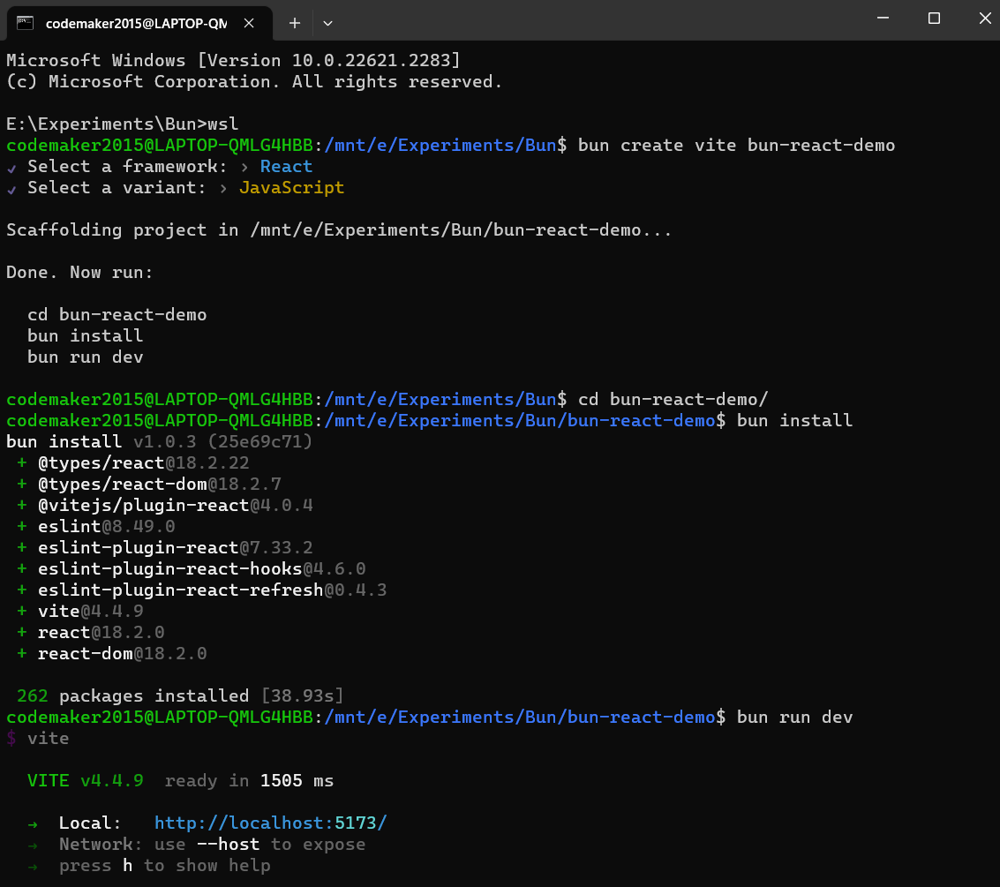

# Bun Demo

Experimenting with various features of Bun framework

## Installation

```
# with install script (recommended)
curl -fsSL https://bun.sh/install | bash

# with npm
npm install -g bun

# with Homebrew
brew tap oven-sh/bun
brew install bun

# with Docker
docker pull oven/bun
docker run --rm --init --ulimit memlock=-1:-1 oven/bun
```

Note: curl in Linux requires unzip package

```
sudo apt update
sudo apt-get install unzip
```

## HTTP Server Demo


## React Demo



